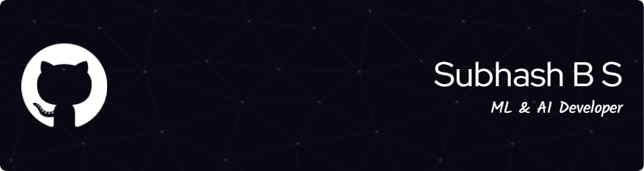

<h1 align="center">🚀 Hey, I'm Subhash! 👋</h1>

  <b>AI Engineer | ML Researcher | Generative AI | AI Agents | Computer Vision</b>

  
  
  
  

---

## 🔥 About Me

- 🎓 **M.S. in Computer Engineering** @ UC Riverside (4.0 GPA)
- 🤖 Passionate about building real-world solutions using **LLMs, Agents, Multimodal AI, and Generative Models**
- 🧠 Skilled in full-stack AI: research, model training, MLOps, & real-time deployment
- 🛠️ Built systems for **QA Automation, Smart Agriculture, Motion Capture, Search Engines, and CV Applications**
- 📚 Published in **Springer, IEEE, IJSREM**

---

## 🚀 Signature Projects

### 🧠 GenAI & LLMs
- 🔍 **[YC Scout](https://github.com/subhashbs36/yc-scout)** — RAG-powered real-time AI search engine for Y Combinator companies  
  _Tech:_ FAISS, Elasticsearch, Groq Llama 3, FastAPI, React

- 🤖 **[Krushak AI Chatbot](https://github.com/subhashbs36/Krushak-Ai-Chatbot)** — Multilingual agri-chatbot using Google Gemma + voice interface  
  _Tech:_ LangChain, Groq, Django, WhatsApp API

- 📬 **[ApplicatorAI](https://github.com/subhashbs36/ApplicatorAI)** — AI assistant for job applications (cover letters, resume optimizer, gradio UI)  
  _Tech:_ LLMs, LaTeX, FastAPI, job board scraper

---

### 🦾 Agents & Automation
- 🔍 **[Project Hawkeye](https://github.com/subhashbs36/Project-Hawkeye)** — AI-powered QA testing agent for visual and accessibility issues  
  _Tech:_ Qwen 2.5VL, YOLO, OmniParser, LLM Studio

---

### 🎥 Multimodal & Computer Vision
- 🎬 **[AI Video Generator](https://github.com/subhashbs36/AI-Video-Generator)** — Diffusion-powered text-to-video system  
  _Tech:_ Stable Diffusion, FFmpeg, RIFE, ESRGAN

- 🧘‍♂️ **[Yoga AI Assistant](https://github.com/subhashbs36/Yoga-AI-Assistant)** — Pose detection + real-time LLM-based coaching  
  _Tech:_ CLIP, TensorRT, MediaPipe, TensorFlowJS

- 🏃 **[Body Posture Comparison Tool](https://github.com/subhashbs36/Body-Posture-Comparison-Tool)** — DTW-based pose comparison for sports & rehab  
  _Tech:_ OpenCV, MediaPipe, DTW, PyQt5

- 🌱 **[MaskRCNN-AgriClassifier](https://github.com/subhashbs36/MaskRCNN-AgriClassifier)** — Classifies crops using Mask-RCNN + elegant GUI  
  _Tech:_ PyQt5, MaskRCNN

- 📸 **[PiGlasses](https://github.com/subhashbs36/PiGlasses-Intelligent-Text-Scanner-Audio-Reader)** — Wearable RPi-based OCR + audio reader  
  _Tech:_ OpenCV, Tesseract, Raspberry Pi 3

---

### 🧠 Research & Publications

📖 **Efficient Patch-Wise Crop Detection Algorithm for UAV-Generated Orthomosaic**  
*Published in Springer Nature, 2024*  
🔗 [Read Publication](https://link.springer.com/chapter/10.1007/978-981-99-8684-2_14)

📖 **Bowling Action Recognition Using Computer Vision**  
*Presented at IEEE IITCEE, 2024*  
🔗 [Read Publication](https://ieeexplore.ieee.org/abstract/document/10467949)

📖 **NAYAN NIRIKSHAN – Violence Detection Using Surveillance Camera**  
*Published in IJSREM, 2023*  
🔗 [Read Publication](https://www.researchgate.net/publication/369922789_NAYAN_NIRIKSHAN_-_Violence_Detection_Using_Surveillance_Camera)

---

## 💻 Tech Stack

**AI/ML**: PyTorch, TensorFlow, LangChain, Hugging Face Transformers  
**LLMs & GenAI**: Llama 3, Google Gemma, Groq, RAG, Prompt Engineering  
**CV & Robotics**: OpenCV, YOLOv5/v8, MediaPipe, MaskRCNN, Sensor Fusion  
**MLOps & Backend**: Docker, Kubernetes, Jenkins, FastAPI, Django  
**Cloud & Infra**: AWS, GCP, LangGraph, GitHub Actions  
**Search & Vectors**: Elasticsearch, FAISS, Pinecone  
**Data Viz**: Tableau, PowerBI

---

## 📊 GitHub Stats

  

---

### ⚡ Fun fact:

---

## 📫 Connect With Me

🚀 Let’s collaborate on the next game-changing AI system!

---

